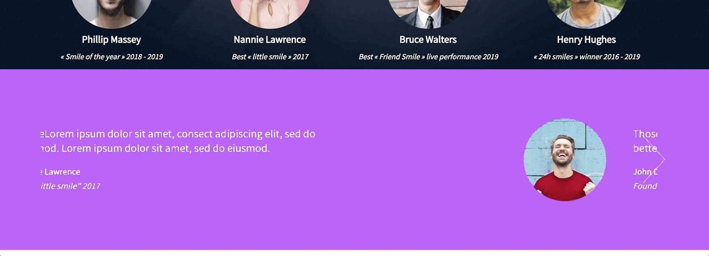

# 0x0F. Build a web app in JavaScript

<p align="center">

</p>

## Context

Hi everybody ! My name's Rémi Marçais and as a software development student, I am constantly learning and growing as a software engineer. In this project, I will finalize the previous project 0x0B. Implement a design with bootstrap and make some parts dynamic with Javascript (JQuery exactly).

I will reuse final files of 0x0B. Implement a design with bootstrap and update them.

I will use all HTML/CSS/Accessibility/Responsive design/Bootstrap/Javascript knowledges that I learned previously.

## Purpose of this project 🎯

I won’t have a lot of instruction, I am free to implement it the way that I want - the objective is simple: Have fully functional web pages that look the same as the designer file.

## Expected result 👀


*Designed by [Nicolas Philippot](https://www.linkedin.com/in/nic0fil/), UX/UI designer.*

## Requirements ⚠️

- I have to use Bootstrap
- My `styles.css` must be as small as I can - **I must use as much as I can Bootstrap classes**
- You have to use JQuery
- Your `scripts.js` must contain all your Javascript part
- Your Javascript must be executed only when the document is loaded

## Import ⬅️

For this project, you will need: fonts from Google, JQuery, Bootstrap CSS/JS

```
<link href="https://fonts.googleapis.com/css?family=Source+Sans+Pro&display=swap" rel="stylesheet">
<link href="https://fonts.googleapis.com/css?family=Coiny&display=swap" rel="stylesheet">

<script src="https://code.jquery.com/jquery-3.4.1.min.js" integrity="sha256-CSXorXvZcTkaix6Yvo6HppcZGetbYMGWSFlBw8HfCJo=" crossorigin="anonymous"></script>
<script src="https://stackpath.bootstrapcdn.com/bootstrap/4.4.1/js/bootstrap.min.js" integrity="sha384-wfSDF2E50Y2D1uUdj0O3uMBJnjuUD4Ih7YwaYd1iqfktj0Uod8GCExl3Og8ifwB6" crossorigin="anonymous"></script>
<script src="https://cdnjs.cloudflare.com/ajax/libs/popper.js/1.12.9/umd/popper.min.js" integrity="sha384-ApNbgh9B+Y1QKtv3Rn7W3mgPxhU9K/ScQsAP7hUibX39j7fakFPskvXusvfa0b4Q" crossorigin="anonymous"></script>

<link rel="stylesheet" href="https://stackpath.bootstrapcdn.com/bootstrap/4.4.1/css/bootstrap.min.css" integrity="sha384-Vkoo8x4CGsO3+Hhxv8T/Q5PaXtkKtu6ug5TOeNV6gBiFeWPGFN9MuhOf23Q9Ifjh" crossorigin="anonymous">

<link rel="stylesheet" href="styles.css">
<script src="scripts.js"></script>
```

## Project steps with result 📝

### **1: Homepage - quotes**
- ### Create the header/hero piece

<p align="center">

</p>

### **2: Homepage - popular tutorials**
  
<p align="center">

</p>

### **3: Homepage - latest videos**
  
<p align="center">

</p>

### **4: Pricing - quotes** *(Same as Homepage - quotes)*

### **5: Courses**
  
<p align="center">

</p>

## Challenges 💪

- Create an interface according to customer request.
- Make the different pages responsive.
- Use all the knowledge seen previously.

## Tools 🛠️

| VS Code | Figma | Chrome DevTools | Bootstrap | HTML5 | CSS3 | jQuery |
|:---:|:---:|:---:|:---:|:---:|:---:|:---:|
|  |  |  |  |  |  |  |

## Cloning the repo ➡️

To clone this repository, you can run this command:
```
git clone git@github.com:rmarcais/holbertonschool-smiling-school-javascript.git
```

## Author 🖊️

| Rémi Marçais (Portfolio projetct [here](https://github.com/rmarcais/Portfolio_project_Motiv)) |
|:---:|
| <a href="https://www.linkedin.com/in/r%C3%A9mi-mar%C3%A7ais-274a4421a/">  <a href="https://github.com/rmarcais">  |
